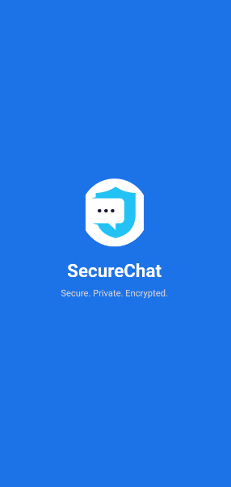
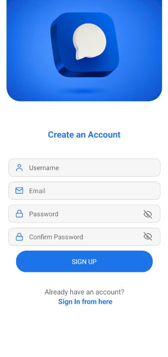
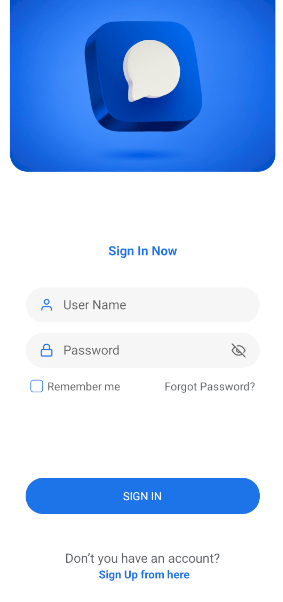
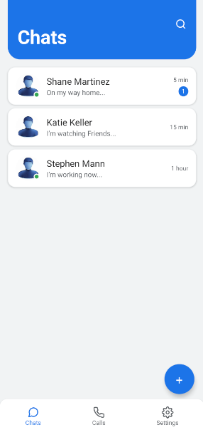
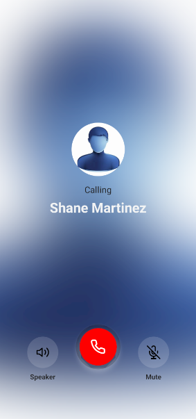
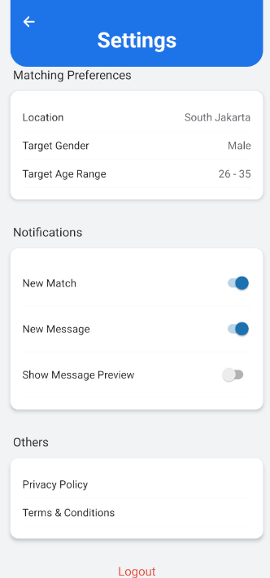

# EncryptedMessagingApp

## 📌 Overview
**EncryptedMessagingApp** is a secure, user-friendly messaging application built with **React Native**. It provides end-to-end encryption for text messages and calls, ensuring your communications remain private and secure. The app features a modern design with both light and dark themes, robust security features, and intuitive navigation.

---

## 🚀 Features
- **End-to-End Encryption (E2EE):** Secure messaging where messages are encrypted on the sender’s device and decrypted only on the recipient’s device.
- **Biometric Authentication:** Support for Face ID/Touch ID for secure app access.
- **Real-Time Chat:** Instant messaging with support for text, images, and file attachments.
- **Voice & Video Calls:** Secure, encrypted calls using WebRTC.
- **Self-Destructing Messages:** Option to auto-delete messages after a specified time.
- **Theme Support:** Light and Dark mode for optimal user experience.

---

## 🛠️ Tech Stack
- **React Native** – For cross-platform mobile development.
- **JavaScript/TypeScript** – Core programming language.
- **React Navigation** – For screen navigation.
- **Expo** *(Optional)* – For rapid testing and development.
- **Cryptography Libraries** – Such as Libsodium or react-native-get-random-values for encryption.

---

## 📸 Screenshots

| Screen                     | Preview                                                         |
|----------------------------|-----------------------------------------------------------------|
| **Splash Screen**          |               |
| **Sign-Up Screen**         |               |
| **Sign-In Screen**         |        |
| **Chat List Screen**       |          |
| **Chat Screen**            |                   |
| **Call Screen**            |                   |
| **Settings Screen**        |               |

---

## 🎨 UI Design

### Colors Used:
- **Primary:** `#00B2FF` – Main brand color used for headers, buttons, and accents.
- **Secondary:** `#2F80ED` – Used for interactive elements and highlights.
- **Neutral:** `#F1F3F4` – Backgrounds, borders, and subtle elements.
- **TextPrimary:** `#202124` – Main text color.
- **TextSecondary:** `#5F6368` – Secondary text, placeholders, etc.
- **White:** `#FFFFFF` – Card backgrounds and default text on dark backgrounds.

### Fonts:
- **Title Font:** **Montserrat Bold** – For app titles and headers.  
  [Montserrat from Google Fonts](https://fonts.google.com/specimen/Montserrat)
- **Header Font:** **Inter** – For section headers and labels.  
  [Inter from Google Fonts](https://fonts.google.com/specimen/Inter)
- **Regular Font:** **Roboto Regular** – For body text and chat messages.  
  [Roboto from Google Fonts](https://fonts.google.com/specimen/Roboto)
- **Bold Font:** **Roboto Bold** – For emphasized text.  
  [Roboto Bold from Google Fonts](https://fonts.google.com/specimen/Roboto)

## 📂 Project Structure
```
EncryptedMessagingApp/
│-- assets/
│   ├── fonts/         // Custom fonts (Montserrat, Inter, Roboto)
│   ├── images/        // Logos, icons, and screenshots
│   ├── sounds/
│   └── colors.js      // Color definitions for the project
│   └── styles.js
│-- components/
│   └── CustomButton.js
│   └── FormInput.js
│-- utils/
│   └── NotificationHandler.js
│-- screens/
│   ├── SplashScreen.js
│   ├── AuthenticationScreen.js
│   ├── SignUpScreen.js
│   ├── ChatListScreen.js
│   ├── ChatScreen.js
│   ├── CallScreen.js
│   ├── VideoCallScreen.js
│   └── SettingsScreen.js
│-- App.js             // Main navigation and app entry point
│-- firebase.js
│-- package.json
│-- README.md
```

## 🟦 Run Online on Expo Snack

You can also test the app directly on Expo's online compiler:
[Run on Expo S](https://snack.expo.dev/@youssef_mohamed/encrypted-messaging-app?platform=android)[nack](https://snack.expo.dev/@youssef_mohamed/encrypted-messaging-app?platform=android)

## 📜 License
This project is **MIT Licensed**. Feel free to use and modify it as needed.

---
Made with ❤️ by [Youssef Mohammed](https://github.com/Youssef-Mohammed72)
